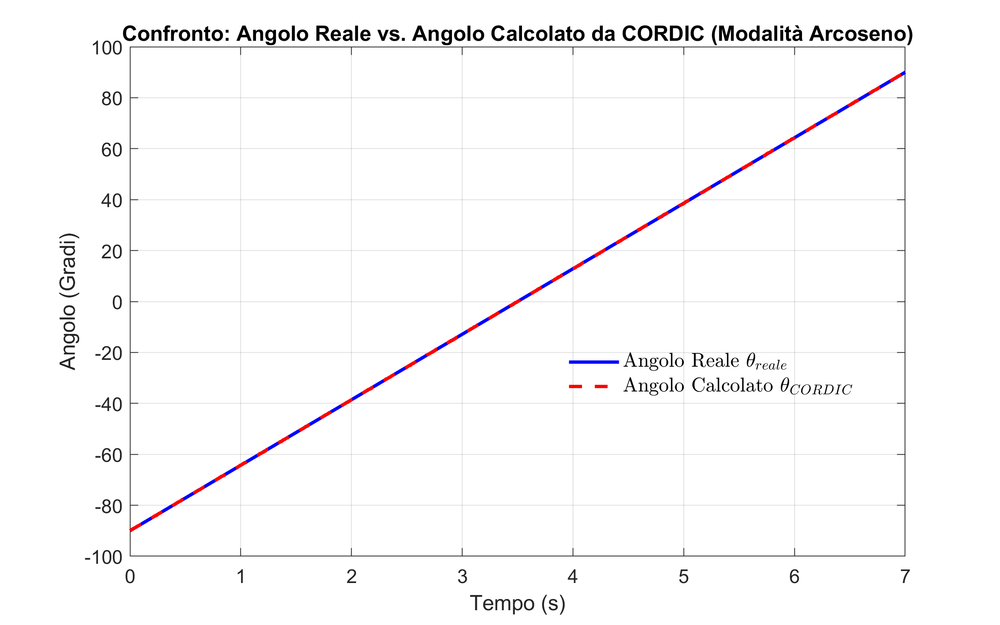

# ⚡ High-Performance CORDIC Processor: RTL Design & Multi-Parameter Analysis

A comprehensive Hardware-Software Co-Design project focused on the **CORDIC (COordinate Rotation DIgital Computer)** algorithm. This repository documents the full engineering workflow: from mathematical prototyping in MATLAB to high-frequency RTL synthesis for FPGA targets.

Developed as a Bachelor's Thesis in Electronic Engineering, the project explores the multidimensional design space of iterative arithmetic processors, balancing precision, area, and speed.

## 🛠️ Tech Stack & Tools
* **Design & Synthesis:** Intel/Altera **Quartus Prime** (VHDL RTL)
* **Simulation & Verification:** **ModelSim** (Functional & Timing simulation)
* **Modeling & Analysis:** **MATLAB** & **Simulink** (Fixed-point Designer)
* **Languages:** VHDL, MATLAB scripts

## 🔬 Multi-Parameter Design Space Exploration
The project conducts a deep dive into engineering trade-offs across three main variables:

### 1. Iterations vs. Accuracy
* **Configurations:** 8, 16, and 32 iterations analyzed.
* **Goal:** Study of mathematical convergence vs. hardware resource utilization (LUTs/Registers).

### 2. Frequency Scaling & Timing Closure
* Optimized 16-iteration core validated for timing closure at **25 MHz**, **50 MHz**, and **100 MHz**.
* Stress-tested via ModelSim to ensure stability in high-throughput digital signal processing.

### 3. Fixed-Point Optimization (Q-Formats)
* Implementation of various bit-width allocations: **Q2.14, Q4.12, Q6.10, Q8.8**.
* Pre-validated via MATLAB to minimize quantization noise before hardware implementation.

---

## 📊 Experimental Results & Statistical Validation

### Graph 1: Error Distribution & Arcsine Estimation Accuracy

> **Description:** This histogram shows the error distribution for the Arcsine estimation. The analysis confirms that the CORDIC algorithm is highly precise, with errors kept within very narrow limits. The distribution is centered at zero, indicating the **absence of significant systematic bias**. The low variance highlights the robustness and reliability of the implementation, which is critical for applications like **Angle of Arrival (AoA) estimation**, where precision is fundamental for localization and target tracking.

### Graph 2: Dynamic Angle Tracking & Signal Fidelity

> **Description:** Visual comparison between the real input angle ($\theta$) and the hardware-calculated angle ($\hat{\theta}_{CORDIC}$). The output faithfully mirrors the original dynamic signal, demonstrating the algorithm's ability to operate on time-varying structures. The precision is quantified by the residual error $Error = \theta_{real} - \hat{\theta}_{CORDIC}$, which remains minimal across the entire operational range.

---

## 🔄 Engineering Workflow
1. **Mathematical Prototyping:** MATLAB scripts to define the optimal Q-format and simulate error bounds.
2. **Behavioral Modeling:** Simulink models used for system-level verification and range extension testing.
3. **RTL Design:** Modular VHDL implementation, optimized for FPGA synthesis.
4. **Hardware Verification:** Bit-true comparison between RTL results (ModelSim) and mathematical models (MATLAB).
5. **Synthesis:** Area and timing report generation using Quartus Prime.

## 📂 Repository Structure
* `/hardware_vhdl`: Source RTL code for all configurations and Graphical models for functional verification
* `/matlab_scripts`: Validation scripts for pre-synthesis error analysis 
* `/docs`: Full Bachelor's Thesis (PDF) and technical synthesis reports.

* `/assets`: High-resolution graphs and simulation waveforms.
